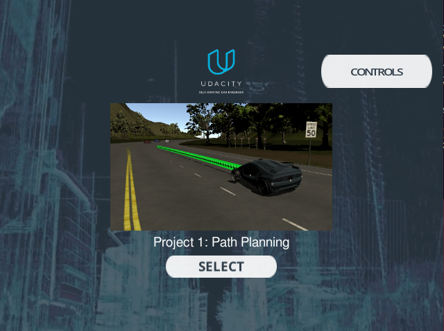
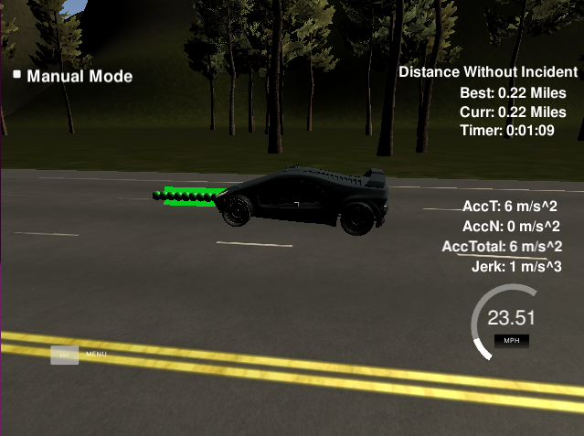

# PathPlanningSDCN
Path planning project for the Udacity Self-driving car nano-degree

### Overview

The goal of the path planning project is to implement a path planning algorithm in order to drive the car on the highway in the [simulator](https://github.com/udacity/self-driving-car-sim/releases/tag/T3_v1.2) provided by Udacity. The algorithm is written in C++, and communicates with the simulator using the [WebSocket](https://en.wikipedia.org/wiki/WebSocket) library. 

The simulator sends the telemetry information to the ego car, i.e. the position and the velocity of the car, as well as the sensor fusion information (e.g. the id of the car, position, velocity) about the other cars that are driving on the highway in the vicinity of the ego car. The path planning algorithm needs to generate a set of points representing the ego car's trajectory, where the points are spaced 0.02 ms in time between each other.


### Code structure

The project is based on the original project [repository](https://github.com/udacity/CarND-Path-Planning-Project) from Udacity. The path planning algorithm is mostly placed in the file _main.cpp_ in the _src_ directory, and the reason for that is that the algorithm is simple enough to reside in a single file, which somewhat simplifies the coding work. 

Functionality of the algorithm can basically be divided in three major parts, as described in the following text. 

#### Prediction [line 256 to line 302](./src/main.cpp#L256)

This code takes the sensor fucion data from the simulator and tries to reason about the environment. Basically, it checks where the other cars are currently located, i.e. whether there are any cars ahead, to the left or to the right. Based on this information, the ego car can later decide whether to change lanes or change velocity. For example, the presence of another car on either side of the ego car may render the lane change towards that direction unsafe. 

#### Behavior [line 304 to line 334](./src/main.cpp#L304)

This code decides whether to change lanes and change the velocity. For example, if there is a car in front of the ego car, which is slower and the ego car wants to overtake it, this code will check whether it is safe to change lanes and if it is, it will do so. Likewise, if the ego car is driving below the speed limit and it is safe to increase the speed, it will do so if there are no cars in front that are rendering this move risky. Finally, if we the ego car is not driving in the center lane, it will check whether it is safe to move back to that lane, because that is the optimum position for the ego car to continue driving down the highway.

#### Trajectory generation [line 336 to line 447](./src/main.cpp#L336)

This code calculates the trajectory points based on the actions derived in the behavior step, the car position and the points from the previous path step. The trajectory generated in this step always has 50 points, which is a combination of the current position of the ego car, the trajectory points from the previous step, and the interpolation based on the spline calculation given the already known points (ego car, previous step). The spline related code is not developed in this project, but it is provided as a third party code in the repository. 

### Setting up the environment 
- The project is configured to compile with cmake and make. Please make sure that the following dependencies are met:
   - cmake version 3.5
   - make version 4.1 for Linux and Mac and 3.81 for Windows
   - gcc/g++ version 5.4
- Download the Udacity simulator from [here](https://github.com/udacity/self-driving-car-sim/releases/)
- Additional libraries need to be installed by running:
   - On Ubuntu, install-ubuntu.sh 
   - On Mac, install-mac.sh
   - On Windows, the recommended way is to run a virtual machine and use the install-ubuntu.sh script
- The project also uses library Eigen 
   - [Eigen](http://eigen.tuxfamily.org/index.php?title=Main_Page). This is already part of the repo so you shouldn't have to worry about it.
   
### How to run the program

After cloning this repository and setting up the environment (as described in the previous section), simply execute the following command to build and run the program:
```
source build.sh
./path_planning
```
At the same time, the Udacity simulator needs to be running, so that the simulator and the main program exchange information. When the simulator starts and the graphics settings are chosen, the scenario "Project 1: Path planning" needs to be chosen, please see the picture below. 



If the program is running and the simulator is also running, the two establish communication and the vehicle in the simulator starts to move, as depicted below. The green line shows the trajectory planned, as shown on the picture below. 



### More information
For even more information on the project structure, dependencies etc. please check original Udacity project [repository](https://github.com/udacity/CarND-Path-Planning-Project)
